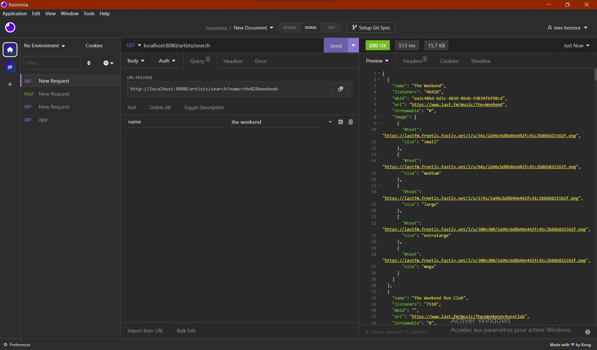
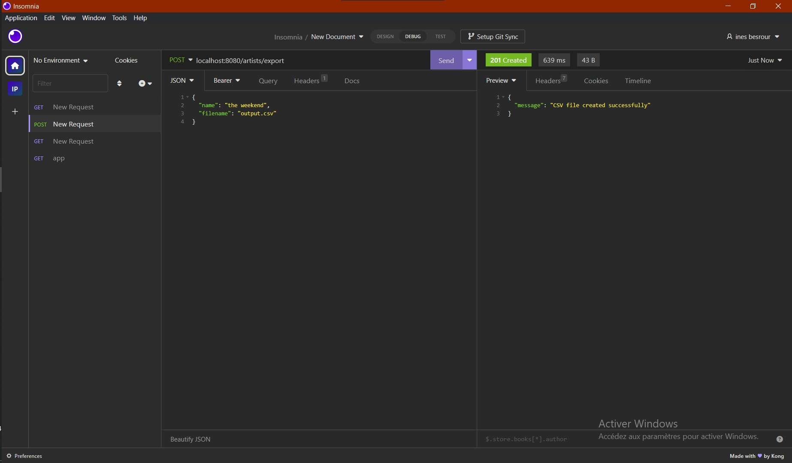
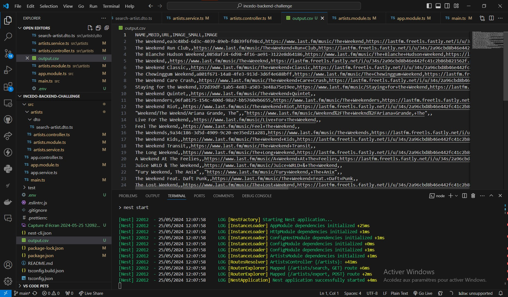

# Backend-challenge

## Overview

This project is a NestJS-based API for searching artists using the Last.fm API and exporting search results to a CSV file. The project is structured using the NestJS framework with modules, controllers, and services.

## Why choosing Nestjs: 

NestJS offers a more structured and maintainable approach with its modular design, TypeScript support, and built-in features, making it a better choice for long-term maintainability and scalability. 

## Installation

1. Clone the repository:

   ```bash
   git clone https://github.com/ines-besrour/Backend-challenge.git
   cd Backend-challenge

2. Install the dependencies:

   ```bash
   npm install


3. Create a .env file in the root of the project and add the Last.fm API key and the port:

   ```bash
   LAST_FM_API_KEY=your_actual_api_key
   PORT=8080

4. run the application
   ```bash
   npm run start

## Endpoints

#### Search Artists

- **URL:** `GET /artists/search`
- **Query Parameters:**
  - `name` (string): The name of the artist to search for.

- **Example Request:**
    ```http
    GET localhost:8080/artists/search?name=the+weekend
    ```

#### Export Artists to CSV

- **URL:** `POST /artists/export`
- **Body Parameters:**
  - `name` (string): The name of the artist to search for.
  - `filename` (string): The name of the CSV file to create.

- **Example Request:**
    ```http
    POST localhost:8080/artists/export
    Content-Type: application/json

    {
      "name": "the weekend",
      "filename": "output.csv"
    }
    ```

## Proof of Concept

Below are screenshots demonstrating that the project works as expected.






